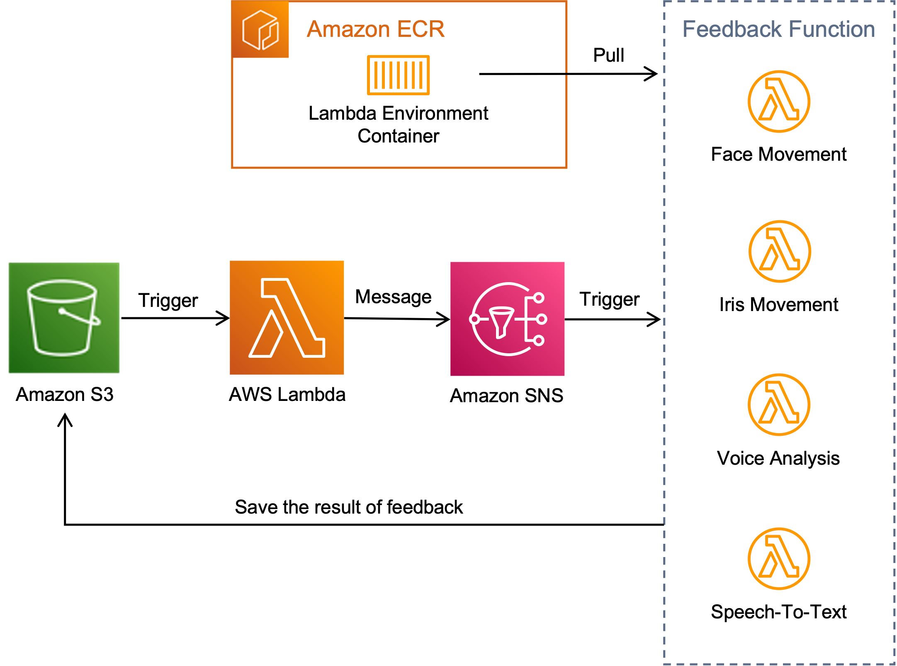

# 머리 움직임 (Face tracing)

## Requirements
- docker
- AWS accounts & Security Credentials \
  (to push container image on [ECR](https://aws.amazon.com/ecr/))

## File Directory
```commandline
feedback
 │  main.py
 │  requirements.txt
 │  Dockerfile
 │  architecture.png
 └─ feedback
     ├─ audio
     │        stt.py
     │        voice_analysis.py
     ├─ video
     │        face_iris_movement.py
     │        face_movement.py
     └─ utils
              io.py
```

## 배포 (Deploy)

### 도커 이미지 빌드하기(Build a Docker Image)
```commandline
# 도커 이미지 (Build Docker Image)
docker build -t face-tracing .
```

### AWS ECR에 도커 이미지 올리기 (Push a Docker Image on AWS ECR)
Pushing a Docker image (AWS Docs) : [link](https://docs.aws.amazon.com/AmazonECR/latest/userguide/docker-push-ecr-image.html)

### 컨테이너 기반 Lambda 함수 만들기 (Create Container Based Lambda Function)
Container based Lambda : [link](https://aws.amazon.com/ko/blogs/korea/new-for-aws-lambda-container-image-support/)

## 함수 설명 (About Function)
### 기본 도커 이미지 (Base Docker Image)
AWS 제공 Lambda 기반 Image (```python3.8```) :``` public.ecr.aws/lambda/python:3.8```

### 사용 대표 라이브러리(Library)
- opencv
- mediapipe
- librosa

### 실행 과정(Step of Function)

